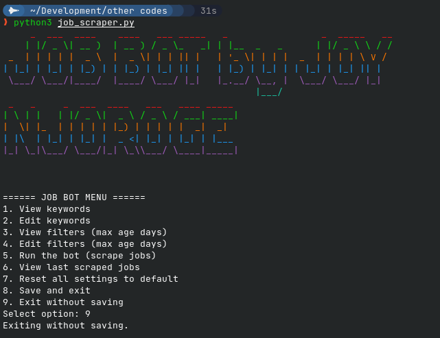

# job_scraper.py

## Overview
`job_scraper.py` is a Python script designed to scrape and aggregate job postings from multiple popular job sites, including LinkedIn, Glassdoor, and Indeed. It allows users to customize keywords and filtering options, manage settings, and save results in a text file.

## Features
- Scrapes jobs based on a user-defined or default set of keywords.
- Supports LinkedIn, Glassdoor, and Indeed.
- Simple configuration for filters such as maximum job age (in days).
- Colorful terminal banners and user-friendly menu.
- Saves job results to a file (`jobs.txt`) and allows previewing the last results.
- Edit or reset keywords and filters easily.

## How It Works
1. **Configuration**: Loads keywords and filters from `job_config.json` or uses the default settings.
2. **Scraping**: For each keyword and job site, sends a request, parses the results, and collects job information.
3. **Menu System**: Offers an interactive menu for viewing/editing keywords and filters, running the scraper, and checking results.
4. **Saving Results**: Writes job listings to `jobs.txt` for later review.

## Usage
Run the script from the terminal:
```bash
python job_scraper.py
```
Follow the interactive menu to configure keywords, set filters, scrape jobs, and view/save results.

## Requirements
- Python 3.x
- `requests`
- `beautifulsoup4`
- `termcolor`
- `pyfiglet`

Install requirements using:
```bash
pip install requests beautifulsoup4 termcolor pyfiglet
```

## Example Screenshot

_Add your screenshot here. Example:_



## File Structure
- `job_scraper.py` - Main script with all logic and menu.
- `job_config.json` - (Optional) Stores your custom keywords and filters.
- `jobs.txt` - Output file with the latest scraped jobs.

## Author
Joy Njoroge

---

Wish you luck in your job applications!
